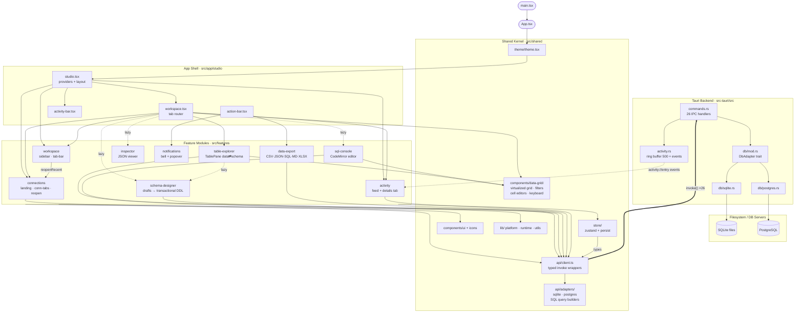
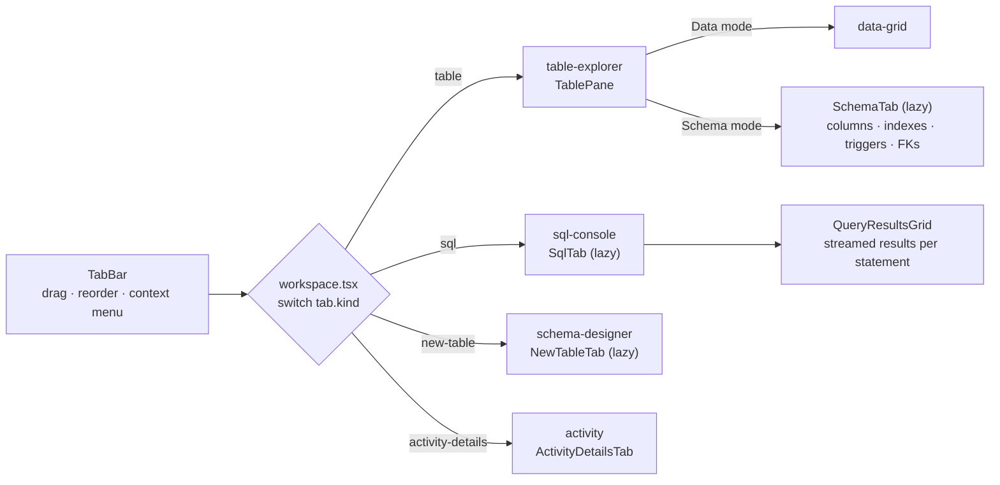
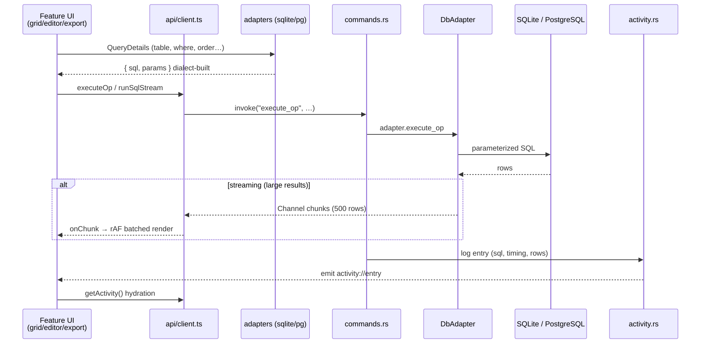

# dh-studio — Architecture Graph Map

Database GUI built with **Tauri 2 + React 19 + TypeScript**, supporting **SQLite** and **PostgreSQL**.

---

## 1. System Layer Graph



---

## 2. Tab Rendering Map

Every open tab is routed by `src/app/studio/workspace.tsx` based on its type in the zustand store:



---

## 3. Query Execution Data Flow



---

## 4. State Model

```mermaid
flowchart LR
    subgraph Persisted["localStorage · survives restart"]
        R["recent conns (max 8)"]
        PG["pg.recents ⚠ plaintext pwd"]
        SIDEBAR["sidebar open/width"]
        DARK["darkmode"]
    end

    subgraph Session["zustand StudioStore · memory only"]
        CONNS["live connections"]
        TABS["tabs + filters + limit<br/>pagination + staged edits"]
        SQLTXT["unsaved SQL text"]
        ACTLOG["activity mirror"]
        NOTIFQ["notifications (50)"]
    end

    subgraph Rust["Rust registry · process-bound"]
        REG["open DbAdapter instances"]
        RB["activity ring buffer (500)"]
    end

    Persisted --- Session --- Rust
```



---

## 5. Directory Tree

```
src/
├── app/studio/            # shell: studio, workspace (tab router), action-bar, activity-bar
├── features/
│   ├── activity/          # live command feed + details tab
│   ├── connections/       # landing screen, connection tabs, recent reopen
│   ├── data-export/       # export menu + format writers (xlsx lazy-loaded)
│   ├── inspector/         # JSON tree viewer
│   ├── notifications/     # bell + toast popover
│   ├── schema-designer/   # draft-based DDL editor, new-table wizard
│   ├── sql-console/       # CodeMirror editor, autocomplete, splitter
│   ├── table-explorer/    # TablePane: data grid ⇄ schema tabs
│   └── workspace/         # sidebar (tables/schema/db switchers) + tab bar
└── shared/
    ├── api/               # client.ts (invoke wrappers) + adapters/ (SQL builders)
    ├── components/
    │   ├── data-grid/     # virtualized grid, cell editors, filter-bar, keyboard
    │   ├── ui/            # base-ui wrappers (button, dialog, select, …)
    │   └── icons/
    ├── lib/               # platform, runtime, utils
    ├── store/             # zustand store: connections + workspace slices
    └── theme/             # dark/light provider + CodeMirror tokens

src-tauri/src/
├── main.rs / lib.rs       # entry + command registration
├── commands.rs            # 26 IPC handlers
├── api.rs                 # wire types + SchemaOp rendering
├── activity.rs            # ring buffer + event emitter
└── db/
    ├── mod.rs             # DbAdapter trait
    ├── sqlite.rs          # incl. alter-column rebuild flow
    └── postgres.rs        # schemas/databases, SSL modes, native enums
```

---

## 6. Key Invariants

- **One-way deps:** `shell → features → shared`. Only violation: `workspace → connections` (`reopenRecent`).
- **Adapters are pure builders:** frontend `adapters/` never touch IO — they return `{sql, params}`; Rust owns execution.
- **DDL is atomic:** `apply_schema_ops` runs all draft ops in one backend transaction; grid row edits currently do **not** (parallel independent statements).
- **Streaming everywhere large:** both `run_sql_stream` and `execute_op_stream` chunk via Tauri `Channel`.
- **Lazy boundaries:** `SqlTab`, `SchemaTab`, `NewTableTab`, `JsonViewer`, `Workspace`, `xlsx` writer are code-split.
