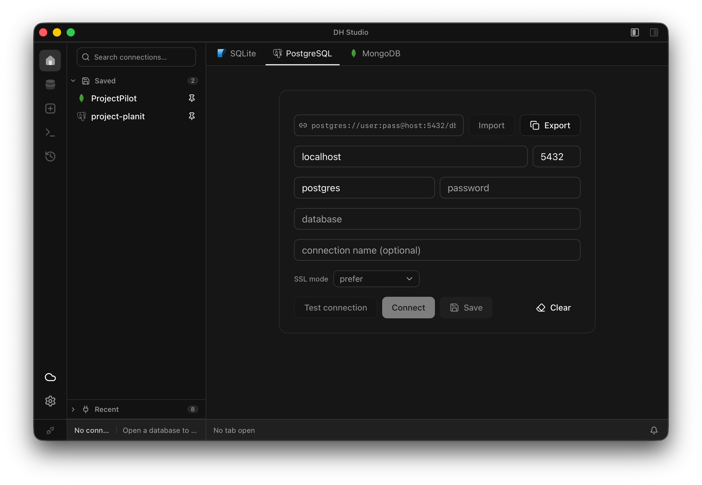
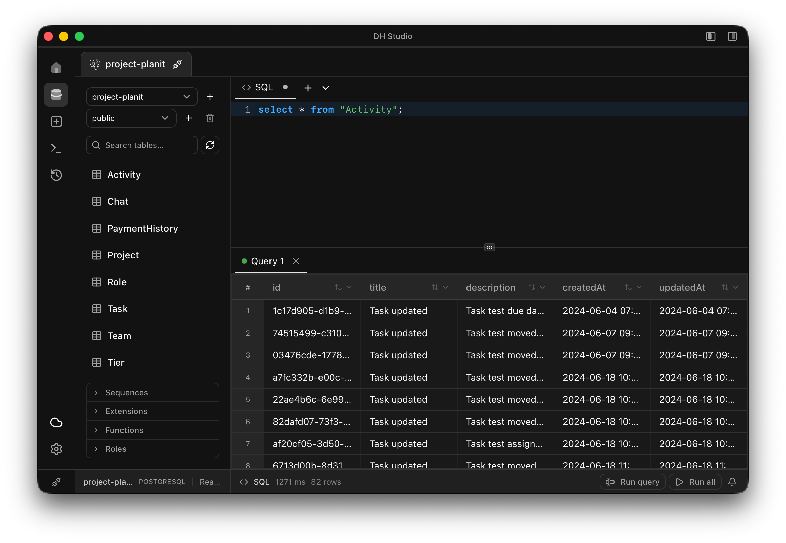

<div align="center">


<h1 align="center">DH Studio</h1>

<p align="center"><strong>A fast, native desktop client for SQLite, PostgreSQL, and MongoDB.</strong></p>

<p align="center">
Browse schemas, edit data in a spreadsheet-style grid, run SQL (or SQL<br/>
against Mongo), and manage every connection from one keyboard-driven app.
</p>

<p align="center">
<a href="https://github.com/abhishek-dagar/data-hive-studio/releases/latest"></a>
<a href="https://github.com/abhishek-dagar/data-hive-studio/actions/workflows/release.yml"></a>
<a href="#download"></a>
<a href="LICENSE"></a>
</p>

<p align="center">
Built with <a href="https://tauri.app/">Tauri</a> (Rust backend, no bundled browser
engine) and React — small installs, native performance.
</p>

</div>

<br/>

<p align="center">
  
</p>
<p align="center">
  <sub>Connect to a saved SQLite, PostgreSQL, or MongoDB connection — or open a local <code>.db</code> file directly.</sub>
</p>

<p align="center">
  
</p>
<p align="center">
  <sub>Browse schemas, run SQL, and edit data in a spreadsheet-style grid.</sub>
</p>

## Contents

- [Features](#features)
- [Download](#download)
- [Development](#development)
- [Tech stack](#tech-stack)
- [License](#license)

## Features

- **Multi-database**: SQLite (open a local `.db` file directly), PostgreSQL,
  and MongoDB — MongoDB gets full CRUD grid editing *and* the SQL editor
  (queries translate to `find`/`aggregate`), not a stripped-down mode.
- **Spreadsheet-style data grid**: inline cell editing per data type, foreign
  key cells jump to the referenced row, multi-cell selection, context menu
  (copy as JSON/SQL/Markdown, clone row, new record), virtualized for large
  tables, streams large result sets instead of loading everything at once.
- **Transactional editing**: edits are staged and highlighted before you
  commit — review as a diff, preview the generated SQL, commit or roll back.
- **SQL & NoSQL editor**: table/column autocomplete (plus Mongo operator
  snippets and `db.` completions), run-all or run-selection with inline error
  markers, saves to and reopens from `.sql`/`.js` files.
- **Schema designer**: create tables with constraints, edit existing schemas
  and triggers, with a diff preview before applying changes.
- **Split-view tabs**: drag a tab to an edge to split the workspace
  horizontally or vertically — arrange multiple tables/queries side by side.
- **Command palette**: quick-open tables, switch/disconnect connections,
  jump to schema, run app commands — all keyboard-driven.
- **Query & activity history** that persists per connection across restarts,
  with an optional view of the app's own background queries.
- **Saved connections** with passwords stored in the OS keychain (Keychain /
  Credential Manager / Secret Service), not plaintext.
- **File associations**: set DH Studio as the default app for
  `.db`/`.sqlite`/`.sqlite3` files, or open one straight from Finder/Explorer's
  right-click menu.
- **Optional team server** (`dh-server`): host shared connections for a team,
  with per-device tokens and role-based access — see
  [`crates/dh-server`](crates/dh-server). Self-hostable via Docker
  (`bun run docker:server`).

## Download

Grab the latest build for macOS, Windows, or Linux from
[Releases](https://github.com/abhishek-dagar/data-hive-studio/releases).

Builds aren't code-signed yet, so first launch needs one extra step:

| Platform | First-launch step |
| --- | --- |
| macOS | Gatekeeper blocks unsigned apps. Run `xattr -cr "/Applications/DH Studio.app"` once in Terminal, then open normally. |
| Windows | SmartScreen shows "Windows protected your PC". Click **More info** → **Run anyway**. |
| Linux | `.deb`/`.rpm` install normally. For `.AppImage`, `chmod +x` it first (needs `libfuse2` on Ubuntu 22.04+). |

Full details are on each [release page](https://github.com/abhishek-dagar/data-hive-studio/releases).

## Development

Requires [Bun](https://bun.sh/) and the [Rust toolchain](https://rustup.rs/)
(Tauri's own [prerequisites](https://tauri.app/start/prerequisites/) apply —
e.g. WebView2 on Windows, the usual build tools on Linux).

```bash
bun install
bun run tauri:dev     # desktop app, hot-reloading
```

Other useful scripts:

```bash
bun run tauri:build   # production desktop build
bun run lint          # eslint
bun run typecheck     # tsc
bun run test:unit     # frontend unit tests (vitest)
bun run test          # backend tests (cargo test -p dh-core)
bun run server        # run the optional team server locally
```

## Tech stack

- **Frontend**: React 19, TypeScript, Zustand, Tailwind CSS, CodeMirror.
- **Backend**: Rust — [Tauri](https://tauri.app/) for the desktop shell,
  `dh-core` for the shared database/adapter logic, `dh-server` (Axum) for the
  optional team-server mode.

## License

Apache License 2.0 — see [`LICENSE`](LICENSE).
