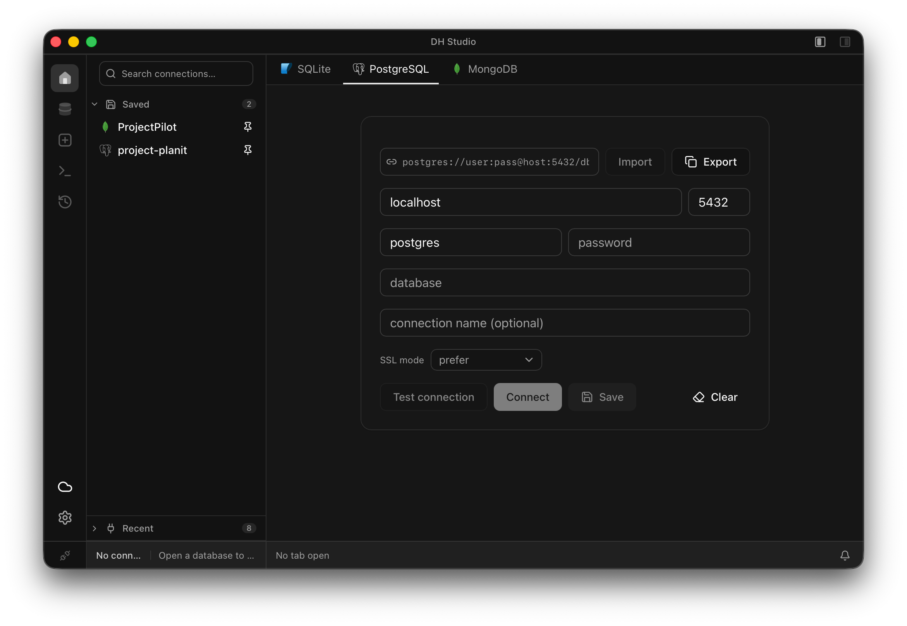
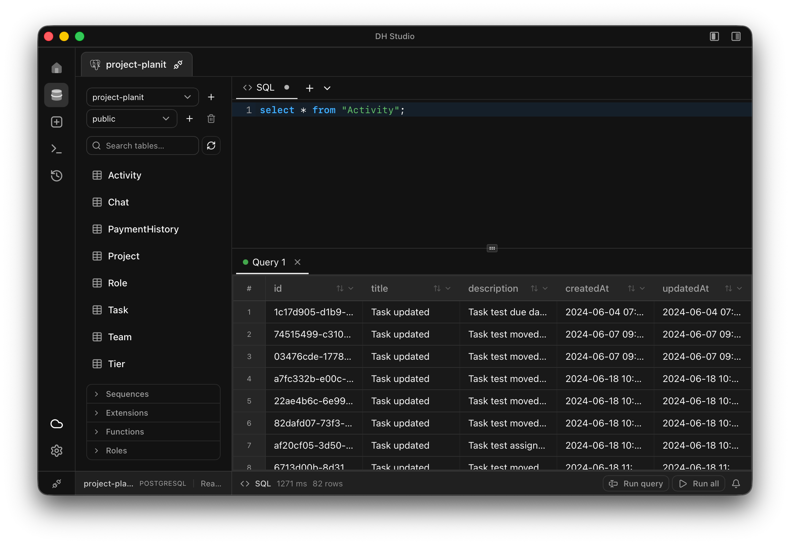

<div align="center">


<h1 align="center">DH Studio</h1>

<p align="center"><strong>A fast, native desktop client for SQLite, PostgreSQL, and MongoDB.</strong></p>

<p align="center">
Browse schemas, edit data in a spreadsheet-style grid, run SQL (or SQL<br/>
against Mongo), and manage every connection from one keyboard-driven app.
</p>

<p align="center">
<a href="https://github.com/OnlyDev-India/data-hive-studio/releases/latest"></a>
<a href="https://github.com/OnlyDev-India/data-hive-studio/actions/workflows/release.yml"></a>
<a href="#download"></a>
<a href="LICENSE"></a>
</p>

<p align="center">
Built with <a href="https://tauri.app/">Tauri</a> (Rust backend, no bundled browser
engine) and React — small installs, native performance.
</p>

</div>

<br/>

<p align="center">
  
</p>
<p align="center">
  <sub>Connect to a saved SQLite, PostgreSQL, or MongoDB connection — or open a local <code>.db</code> file directly.</sub>
</p>

<p align="center">
  
</p>
<p align="center">
  <sub>Browse schemas, run SQL, and edit data in a spreadsheet-style grid.</sub>
</p>

## Contents

- [Features](#features)
- [Download](#download)
- [Development](#development)
- [Tech stack](#tech-stack)
- [License](#license)

## Features

- **Multi-database**: SQLite (open a local `.db` file directly), PostgreSQL,
  and MongoDB — MongoDB gets full CRUD grid editing _and_ the SQL editor
  (queries translate to `find`/`aggregate`), not a stripped-down mode.
- **Spreadsheet-style data grid**: inline cell editing per data type, foreign
  key cells jump to the referenced row, multi-cell selection, context menu
  (copy as JSON/SQL/Markdown, clone row, new record), virtualized for large
  tables, streams large result sets instead of loading everything at once.
- **Transactional editing**: edits are staged and highlighted before you
  commit — review as a diff, preview the generated SQL, commit or roll back.
- **SQL & NoSQL editor**: table/column autocomplete (plus Mongo operator
  snippets and `db.` completions), run-all or run-selection with inline error
  markers, saves to and reopens from `.sql`/`.js` files.
- **Schema designer**: create tables with constraints, edit existing schemas
  and triggers, with a diff preview before applying changes.
- **Split-view tabs**: drag a tab to an edge to split the workspace
  horizontally or vertically — arrange multiple tables/queries side by side.
- **Command palette**: quick-open tables, switch/disconnect connections,
  jump to schema, run app commands — all keyboard-driven.
- **Query & activity history** that persists per connection across restarts,
  with an optional view of the app's own background queries.
- **Saved connections** with passwords stored in the OS keychain (Keychain /
  Credential Manager / Secret Service), not plaintext.
- **File associations**: set DH Studio as the default app for
  `.db`/`.sqlite`/`.sqlite3` files, or open one straight from Finder/Explorer's
  right-click menu.
- **Optional team server** (`dh-server`): host shared connections for a team,
  with per-device tokens and role-based access — see
  [`crates/dh-server`](crates/dh-server). Self-hostable via Docker
  (`bun run docker:server`).

## Download

The quickest way is one command. It downloads the right build for your computer, checks it against the release's `SHA256SUMS.txt`, installs it, and opens DH Studio. Files fetched this way carry no "downloaded from the internet" mark, so Gatekeeper and SmartScreen don't step in.

**macOS and Linux**

```sh
curl -fsSL https://github.com/OnlyDev-India/data-hive-studio/releases/latest/download/install.sh | sh
```

No `curl`? Use `wget -qO- https://github.com/OnlyDev-India/data-hive-studio/releases/latest/download/install.sh | sh`.

**Windows (PowerShell)**

```powershell
irm https://github.com/OnlyDev-India/data-hive-studio/releases/latest/download/install.ps1 | iex
```

Run the same command again to update. It replaces the app in place and keeps your connections and settings.

- macOS installs to `/Applications/DH Studio.app` (it asks for your password if that folder isn't writable).
- Linux uses your package manager (`.deb` with apt, `.rpm` with dnf, yum or zypper), or else installs the AppImage to `~/.local/bin` with a menu entry. Only x86_64 is supported.
- Windows runs the normal setup wizard, installed for your user, so no admin prompt.

Options are environment variables: `DH_NO_LAUNCH=1` skips opening the app, `DH_FORMAT=deb|rpm|appimage` picks the Linux format, and `DH_SILENT=1` installs on Windows with no wizard. For example `curl -fsSL … | DH_FORMAT=appimage sh`, or `$env:DH_SILENT=1; irm … | iex`. To install a specific version, swap `latest/download` for `download/v0.5.4` (any release from 0.5.4 on).

The checksum catches a broken or cut off download, but it lives in the same release as the files, so it can't protect against a compromised release. You're trusting this repo's GitHub releases either way.

### Downloading from the browser

Builds aren't notarized or code signed yet, so a browser download needs one extra click on first launch. Grab the file from [Releases](https://github.com/OnlyDev-India/data-hive-studio/releases).

| Platform | First launch                                                                                                                                               |
| -------- | ---------------------------------------------------------------------------------------------------------------------------------------------------------- |
| macOS    | If the app won't open, go to System Settings, Privacy and Security, and click **Open Anyway**. On macOS 14 and older, right click the app and choose Open. |
| Windows  | SmartScreen shows "Windows protected your PC". Click **More info**, then **Run anyway**.                                                                   |
| Linux    | `.deb`/`.rpm` install normally. For `.AppImage`, `chmod +x` it first (needs `libfuse2` on Ubuntu 22.04+).                                                  |

**Smart App Control (Windows 11):** if it's on, it may block DH Studio even with the one line install, because the app isn't code signed yet. The only workaround today is turning Smart App Control off in Windows Security, App and browser control. Note that Windows doesn't let you turn it back on without a reset.

## Development

Requires [Bun](https://bun.sh/) and the [Rust toolchain](https://rustup.rs/)
(Tauri's own [prerequisites](https://tauri.app/start/prerequisites/) apply —
e.g. WebView2 on Windows, the usual build tools on Linux).

```bash
bun install
bun run tauri:dev     # desktop app, hot-reloading
```

Other useful scripts:

```bash
bun run tauri:build   # production desktop build
bun run lint          # eslint
bun run typecheck     # tsc
bun run test:unit     # frontend unit tests (vitest)
bun run test          # backend tests (cargo test -p dh-core)
bun run server        # run the optional team server locally
```

## Tech stack

- **Frontend**: React 19, TypeScript, Zustand, Tailwind CSS, CodeMirror.
- **Backend**: Rust — [Tauri](https://tauri.app/) for the desktop shell,
  `dh-core` for the shared database/adapter logic, `dh-server` (Axum) for the
  optional team-server mode.

## License

Apache License 2.0 — see [`LICENSE`](LICENSE).
